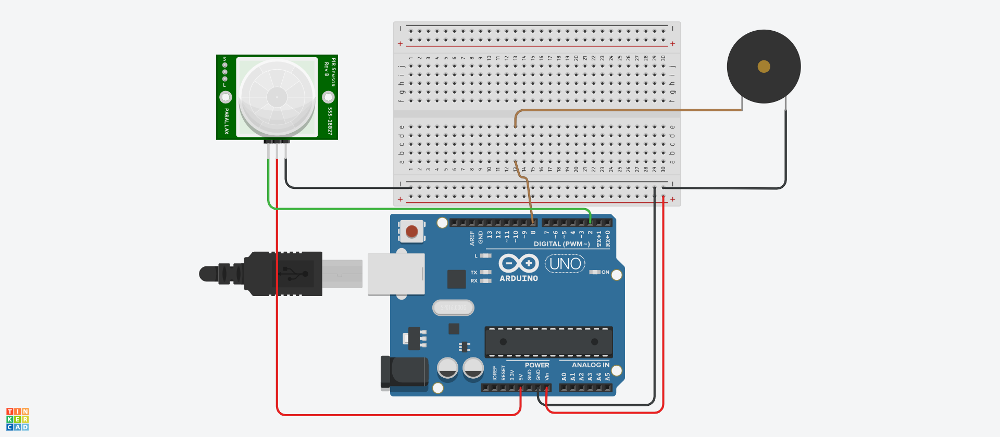

# [Arduino Motion Detector](https://www.tinkercad.com/embed/hhxlP03cef9)
Arduino code for integrating motion sensor and buzzer speaker

## Parts
* [Arduino Nano v3](https://www.amazon.com/gp/product/B0713XK923)
* [Infrared PIR Motion Sensor HC-SR501](https://www.amazon.com/s?k=HC-SR501)
* [Buzzer Speaker](https://www.amazon.com/s?k=buzzer+speaker)

## Ref
* https://learn.adafruit.com/pir-passive-infrared-proximity-motion-sensor/using-a-pir-w-arduino
* https://eecs.oregonstate.edu/education/docs/pir/31227sc.pdf
* https://www.arduino.cc/en/Tutorial/ToneMelody?from=Tutorial.Tone
* https://www.arduino.cc/reference/en/language/functions/advanced-io/tone/
* https://www.arduino.cc/reference/en/language/functions/advanced-io/notone/
* https://itp.nyu.edu/physcomp/labs/labs-arduino-digital-and-analog/tone-output-using-an-arduino/
